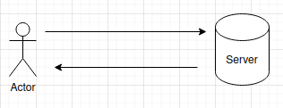

# An outline of the development of the Comms command line interface
This document contains information about the iterative development process and analysis of the application as 
outlined in the introduction section. The application will be developed in c++ utilizing sockets with TCP connections
with further developments a mobile application may be built for either android or OS.
## Introduction
The Comms command line interface (CCLI) will be based on the onion routing protocol. It will contain
a few key features:
1) Routing messages through N-servers, randomized for each connection.
2) The routing between the servers needs to be self-stabilizing.
3) The routing should tolerate Byzantine faults for each group of servers.

## Initial setup
The first stage of development is to create a simple client-server architecture. Where the client
sends messages to the server and receives responses. This will be later be extended. Here no
weight is put on points 1,2,3 from the introduction.

### Client code

### Server code